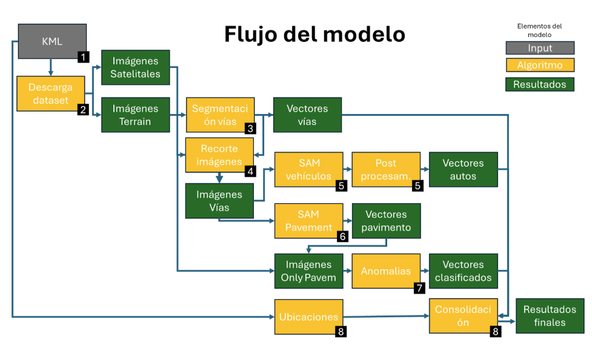

# RoadScan

RoadScan es una herramienta diseñada para evaluar la transitabilidad en vías, incluyendo la detección de vehículos y de anomalías en el pavimento. Este repositorio contiene la metodología y los notebooks desarrollados para evaluar el estado de las vías usando imágenes satelitales tipo TMS, modelos de segmentación como SAM, y algoritmos de detección de anomalías. Se puede usar para otros tipos de lugares especificando las áreas de descarga desde un archivo KML.

El enfoque de este proyecto combina técnicas de procesamiento de imágenes, machine learning y algoritmos de detección avanzada para lograr una segmentación precisa de las vías, identificar vehículos en movimiento y evaluar anomalías en la infraestructura vial. La automatización de estos procesos reduce la necesidad de inspecciones manuales y proporciona una herramienta eficiente para el monitoreo en tiempo real.

---

## 🗂 Estructura del Proyecto



| Archivo / Notebook              | Descripción breve |
|-------------------------------|-------------------|
| `2_CreacionBB_DescargaDataset.ipynb` | Genera los bounding boxes a partir del KML y descarga imágenes TMS (Terrain / Satellite). |
| `3_SegmentacionVias.ipynb`           | Segmenta la infraestructura vial desde imágenes Terrain usando umbralización y morfología. |
| `4_RecorteImagenesVias.ipynb`        | Recorta imágenes satelitales para conservar solo la vía (intersección espacial con shapefiles). |
| `5_SAM_Vehiculos.ipynb`              | Usa LangSAM con prompt `cars, buses and trucks` para segmentar vehículos en las vías. |
| `6_SAM_Pavement.ipynb`               | Usa LangSAM para segmentar únicamente el pavimento y eliminar ruido visual lateral. |
| `7_Anomalias.ipynb`                  | Detecta anomalías visuales (como manchas o baches) usando filtrado cromático en HSV. |
| `8_GeocodificacionInversa.ipynb`     | Aplica geocodificación inversa a los segmentos de vía para extraer ubicación detallada. |
| `8_Consolidacion.ipynb`              | Consolida todos los resultados (vía, autos, anomalías, ubicación) en una tabla unificada. |

---

## 📦 Requisitos

Para correr los notebooks necesitas un entorno Python 3.8+ con las siguientes librerías:

```bash
pip install geopandas rasterio matplotlib opencv-python shapely tqdm segment-anything samgeo pandas numpy leafmap pyproj scikit-image geopy requests
```

> **Nota**: El proyecto utiliza el modelo SAM (Segment Anything Model). El checkpoint necesario se descarga automáticamente en los notebooks correspondientes.

---

## 🚀 Cómo usar

### Orden de ejecución recomendado

El diagrama "Flujo del modelo" (arriba) muestra visualmente el pipeline completo. Los notebooks deben ejecutarse en el siguiente orden:

1. **`2_CreacionBB_DescargaDataset.ipynb`** - Genera bounding boxes desde KML y descarga imágenes satelitales + terrain
2. **`3_SegmentacionVias.ipynb`** - Segmenta las vías desde imágenes terrain
3. **`4_RecorteImagenesVias.ipynb`** - Recorta imágenes satelitales para aislar solo las vías
4. **`5_SAM_Vehiculos.ipynb`** - Detecta vehículos usando LangSAM (genera vectores de autos)
5. **`6_SAM_Pavement.ipynb`** - Segmenta pavimento limpio (genera imágenes "only pavement")
6. **`7_Anomalias.ipynb`** - Detecta anomalías visuales en pavimento (genera vectores clasificados)
7. **`8_GeocodificacionInversa.ipynb`** - Añade información de ubicación geográfica
8. **`8_Consolidacion.ipynb`** - Consolida todos los resultados en vectores unificados

### Requisitos previos

- Archivo KML con las áreas de interés a analizar
- Acceso a imágenes satelitales tipo TMS (Terrain/Satellite)
- Espacio en disco para almacenar imágenes descargadas y resultados procesados

### Configuración básica

Cada notebook contiene variables configurables al inicio. Las principales son:

- `troncal`: Identificador de la vía o ruta a analizar
- `BB`: Parámetro de bounding box extendido
- `z`: Nivel de zoom para las imágenes satelitales

> **⚠️ Documentación en desarrollo**: Estamos trabajando en ampliar la documentación de parámetros específicos y casos de uso. Para contribuir o reportar problemas, por favor abre un issue.

---

## 📊 Salidas del Pipeline

El pipeline genera los siguientes tipos de archivos:

- **Imágenes `.tif`**: Resultados de segmentación en formato raster
- **Archivos `.shp`**: Vectores geoespaciales de vías, vehículos y anomalías
- **Archivos `.geojson`**: Versión web-friendly de los vectores
- **Archivos `.txt`**: Reportes de análisis cromático y anomalías
- **Imágenes `.jpg`**: Visualizaciones comparativas

---

## 🤝 Contribuciones

Este proyecto está en desarrollo activo. Las contribuciones son bienvenidas, especialmente en:

- Mejoras de documentación
- Optimización de algoritmos
- Nuevos casos de uso
- Corrección de bugs

Para contribuir, por favor abre un Pull Request o un Issue describiendo tu propuesta.

---


## Acknowledgments / Reconocimientos

**Copyright © [2025]. Inter-American Development Bank ("IDB"). Authorized Use.**  
The procedures and results obtained based on the execution of this software are those programmed by the developers and do not necessarily reflect the views of the IDB, its Board of Executive Directors or the countries it represents.

**Copyright © [2025]. Banco Interamericano de Desarrollo ("BID"). Uso Autorizado.**  
Los procedimientos y resultados obtenidos con la ejecución de este software son los programados por los desarrolladores y no reflejan necesariamente las opiniones del BID, su Directorio Ejecutivo ni los países que representa.

### Support and Usage Documentation / Documentación de Soporte y Uso

**Copyright © [2025]. Inter-American Development Bank ("IDB").** The Support and Usage Documentation is licensed under the Creative Commons License CC-BY 4.0 license. The opinions expressed in the Support and Usage Documentation are those of its authors and do not necessarily reflect the opinions of the IDB, its Board of Executive Directors, or the countries it represents.

**Copyright © [2025]. Banco Interamericano de Desarrollo (BID).** La Documentación de Soporte y Uso está licenciada bajo la licencia Creative Commons CC-BY 4.0. Las opiniones expresadas en la Documentación de Soporte y Uso son las de sus autores y no reflejan necesariamente las opiniones del BID, su Directorio Ejecutivo ni los países que representa.

### AI-Powered Services Disclaimer / Exención de responsabilidad por Servicios Impulsados por IA

The Software may include features which use, are powered by, or are an artificial intelligence system (“AI-Powered Services”), and as a result, the services provided via the Software may not be completely error-free or up to date. Additionally, the User acknowledges that due to the incorporation of AI-Powered Services in the Software, the Software may not dynamically (in “real time”) retrieve information and that, consequently, the output provided to the User may not account for events, updates, or other facts that have occurred or become available after the Software was trained. Accordingly, the User acknowledges that the use of the Software, and that any actions taken or reliance on such products, are at the User’s own risk, and the User acknowledges that the User must independently verify any information provided by the Software.

El Software puede incluir funciones que utilizan, están impulsadas por o son un sistema de inteligencia artificial (“Servicios Impulsados por IA”) y, como resultado, los servicios proporcionados a través del Software pueden no estar completamente libres de errores ni actualizados. Además, el Usuario reconoce que, debido a la incorporación de Servicios Impulsados por IA en el Software, este puede no recuperar información dinámicamente (en “tiempo real”) y que, en consecuencia, la información proporcionada al Usuario puede no reflejar eventos, actualizaciones u otros hechos que hayan ocurrido o estén disponibles después del entrenamiento del Software. En consecuencia, el Usuario reconoce que el uso del Software, y que cualquier acción realizada o la confianza depositada en dichos productos, se realiza bajo su propio riesgo, y reconoce que debe verificar de forma independiente cualquier información proporcionada por el Software.
